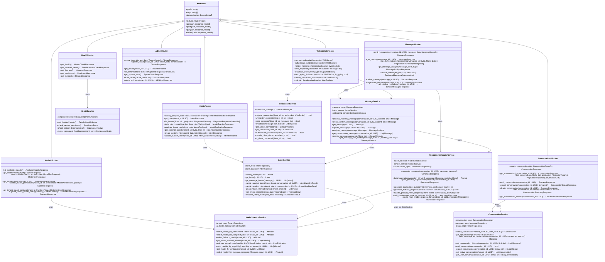

```mermaid
classDiagram
    %% Router Classes
    class APIRouter {
        +prefix: string
        +tags: string[]
        +dependencies: Dependency[]
        +include_router(router)
        +get(path, response_model)
        +post(path, response_model)
        +put(path, response_model)
        +delete(path, response_model)
    }
    
    class HealthRouter {
        +get_health() : HealthCheckResponse
        +get_detailed_health() : DetailedHealthCheckResponse
        +get_liveness() : LivenessResponse
        +get_readiness() : ReadinessResponse
        +get_metrics() : MetricsResponse
    }
    
    class ConversationsRouter {
        +create_conversation(data: ConversationCreate) : ConversationResponse
        +get_conversation(conversation_id: UUID) : ConversationResponse
        +list_conversations(filters: dict, pagination: PaginationParams) : PaginatedResponse[ConversationList]
        +end_conversation(conversation_id: UUID) : SuccessResponse
        +export_conversation(conversation_id: UUID, format: str) : ConversationExportResponse
        +delete_conversation(conversation_id: UUID) : SuccessResponse
        +get_conversation_summary(conversation_id: UUID) : ConversationSummaryResponse
        +get_conversation_metrics(conversation_id: UUID) : ConversationMetricsResponse
    }
    
    class MessagesRouter {
        +send_message(conversation_id: UUID, message_data: MessageCreate) : MessageResponse
        +get_message(message_id: UUID) : MessageResponse
        +list_conversation_messages(conversation_id: UUID, filters: dict) : PaginatedResponse[MessageList]
        +get_message_analysis(message_id: UUID) : MessageAnalysisResponse
        +search_messages(query: str, filters: dict) : PaginatedResponse[MessageList]
        +delete_message(message_id: UUID) : SuccessResponse
        +regenerate_response(message_id: UUID) : MessageResponse
        +get_similar_messages(message_id: UUID) : SimilarMessagesResponse
    }
    
    class IntentsRouter {
        +classify_text(text_data: TextClassificationRequest) : IntentClassificationResponse
        +get_intent(intent_id: UUID) : IntentResponse
        +list_intents(filters: dict, pagination: PaginationParams) : PaginatedResponse[IntentList]
        +train_intent_model(training_data: IntentTrainingData) : ModelTrainingResponse
        +evaluate_intent_model(test_data: IntentTestData) : ModelEvaluationResponse
        +get_common_intents(tenant_id: UUID, limit: int) : CommonIntentsResponse
        +create_custom_intent(intent_data: IntentCreate) : IntentResponse
        +update_custom_intent(intent_id: UUID, intent_data: IntentUpdate) : IntentResponse
    }
    
    class ModelsRouter {
        +list_available_models() : AvailableModelsResponse
        +get_model(model_id: str) : ModelResponse
        +test_model(model_id: str, test_data: ModelTestRequest) : ModelTestResponse
        +get_model_metrics(model_id: str) : ModelMetricsResponse
        +update_model_preferences(model_id: str, preferences: ModelPreferencesUpdate) : SuccessResponse
        +get_tenant_model_settings(tenant_id: UUID) : TenantModelSettingsResponse
        +update_tenant_model_settings(tenant_id: UUID, settings: TenantModelSettingsUpdate) : SuccessResponse
    }
    
    class AdminRouter {
        +create_tenant(tenant_data: TenantCreate) : TenantResponse
        +update_tenant(tenant_id: UUID, tenant_data: TenantUpdate) : TenantResponse
        +get_tenant(tenant_id: UUID) : TenantResponse
        +list_tenants(filters: dict) : PaginatedResponse[TenantList]
        +get_system_stats() : SystemStatsResponse
        +flush_cache(cache_name: str) : SuccessResponse
        +rotate_api_keys(tenant_id: UUID) : APIKeysResponse
    }
    
    class WebSocketsRouter {
        +connect_websocket(websocket: WebSocket)
        +authenticate_websocket(websocket: WebSocket)
        +handle_incoming_message(websocket: WebSocket)
        +send_response(websocket: WebSocket, message: dict)
        +broadcast_event(event_type: str, payload: dict)
        +send_typing_indicator(websocket: WebSocket, is_typing: bool)
        +handle_connection_close(websocket: WebSocket)
        +maintain_heartbeat(websocket: WebSocket)
    }
    
    %% Service Classes
    class HealthService {
        -componentCheckers: List[ComponentChecker]
        +get_detailed_health() : DetailedHealthStatus
        +check_service_readiness() : ReadinessStatus
        +check_critical_dependencies() : DependencyStatus
        -check_component_health(component: str) : ComponentHealth
    }
    
    class ConversationService {
        -conversation_repo: ConversationRepository
        -message_repo: MessageRepository
        -tenant_repo: TenantRepository
        +create_conversation(tenant_id: UUID, user_id: UUID) : Conversation
        +get_conversation(id: UUID) : Conversation
        +add_message_to_conversation(conversation_id: UUID, content: str, role: str) : Message
        +get_conversation_history(conversation_id: UUID, limit: int) : List[Message]
        +end_conversation(conversation_id: UUID) : bool
        +export_conversation(conversation_id: UUID, format: str) : ExportResult
        +get_active_conversations(tenant_id: UUID) : List[Conversation]
        +get_user_conversations(user_id: UUID, status: str) : List[Conversation]
    }
    
    class MessageService {
        -message_repo: MessageRepository
        -intent_service: IntentService
        -embedding_service: EmbeddingService
        +process_incoming_message(conversation_id: UUID, content: str) : Message
        +create_system_message(conversation_id: UUID, content: str) : Message
        +get_message(id: UUID) : Message
        +update_message(id: UUID, data: dict) : Message
        +analyze_message(message: Message) : MessageAnalysis
        +get_conversation_messages(conversation_id: UUID) : List[Message]
        +search_messages(query: str, filters: dict) : SearchResults
        +get_message_with_context(message_id: UUID, context_size: int) : MessageContext
    }
    
    class IntentService {
        -intent_repo: IntentRepository
        -intent_classifier: IntentClassifier
        +classify_intent(text: str) : Intent
        +get_intent(id: UUID) : Intent
        +get_message_intents(message_id: UUID) : List[Intent]
        +handle_product_intent(intent: Intent, conversation_id: UUID) : IntentHandlingResult
        +handle_service_intent(intent: Intent, conversation_id: UUID) : IntentHandlingResult
        +get_common_intents(tenant_id: UUID, limit: int) : List[Intent]
        +train_intent_model(training_data: TrainingData) : TrainingResult
        +evaluate_intent_model(test_data: TestData) : EvaluationResult
    }
    
    class ResponseGeneratorService {
        -model_selector: ModelSelectorService
        -context_service: ContextService
        -conversation_repo: ConversationRepository
        +generate_response(conversation_id: UUID, message: Message) : GeneratedResponse
        +build_prompt(conversation_id: UUID, message: Message, model: AIModel) : Prompt
        +post_process_response(response: str, conversation_id: UUID) : ProcessedResponse
        +generate_clarification_question(intent: Intent, confidence: float) : str
        +generate_fallback_response(error: Exception, conversation_id: UUID) : str
        +handle_product_intent_response(intent: Intent, conversation_id: UUID) : str
        +add_citations(response: str, sources: List[Source]) : AnnotatedResponse
        +create_multi_model_response(conversation_id: UUID, message: Message) : MultiModelResponse
    }
    
    class ModelSelectorService {
        -tenant_repo: TenantRepository
        -ai_model_factory: AIModelFactory
        +select_model_for_intent(intent: Intent, tenant_id: UUID) : AIModel
        +select_model_for_complexity(text: str, tenant_id: UUID) : AIModel
        +select_fallback_model(tenant_id: UUID) : AIModel
        +get_tenant_allowed_models(tenant_id: UUID) : List[AIModel]
        +estimate_model_costs(models: List[AIModel], token_count: int) : CostEstimates
        +rank_models_by_capability(capability: str, tenant_id: UUID) : List[AIModel]
        +get_model_for_embedding(tenant_id: UUID) : AIModel
        +select_model_for_message(message: Message, tenant_id: UUID) : AIModel
    }
    
    class WebSocketService {
        -connection_manager: ConnectionManager
        +register_connection(client_id: str, websocket: WebSocket) : bool
        +unregister_connection(client_id: str) : bool
        +send_message(client_id: str, message: dict) : bool
        +broadcast(message: dict, exclude: List[str]) : int
        +get_active_connections() : List[Connection]
        +get_connection(client_id: str) : Connection
        +authenticate_connection(client_id: str, token: str) : bool
        +handle_client_disconnect(client_id: str) : void
        +is_client_connected(client_id: str) : bool
    }
    
    %% Relationships between routers and services
    HealthRouter --> HealthService : uses
    ConversationsRouter --> ConversationService : uses
    MessagesRouter --> MessageService : uses
    MessagesRouter --> ResponseGeneratorService : uses
    IntentsRouter --> IntentService : uses
    ModelsRouter --> ModelSelectorService : uses
    WebSocketsRouter --> WebSocketService : uses
    WebSocketsRouter --> MessageService : uses
    
    %% Router inheritance from FastAPI's APIRouter
    APIRouter <|-- HealthRouter
    APIRouter <|-- ConversationsRouter
    APIRouter <|-- MessagesRouter
    APIRouter <|-- IntentsRouter
    APIRouter <|-- ModelsRouter
    APIRouter <|-- AdminRouter
    APIRouter <|-- WebSocketsRouter
    
    %% Service relationships
    MessageService --> IntentService : uses
    MessageService --> ResponseGeneratorService : uses
    ResponseGeneratorService --> ModelSelectorService : uses
    ResponseGeneratorService --> ConversationService : uses
    IntentService --> ModelSelectorService : uses for classification
```