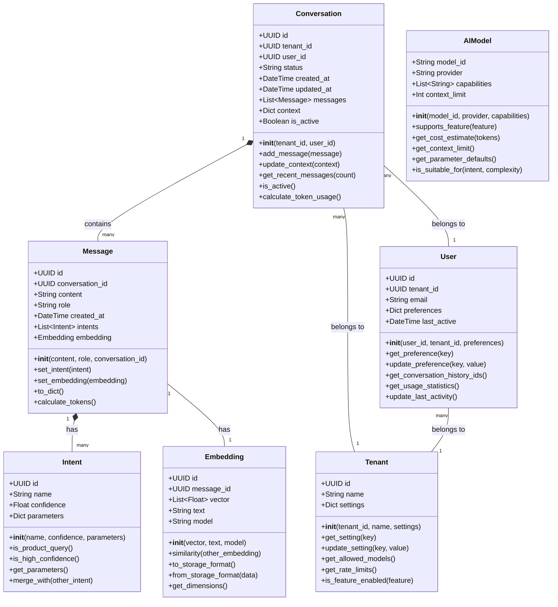

```mermaid
classDiagram
    class Conversation {
        +UUID id
        +UUID tenant_id
        +UUID user_id
        +String status
        +DateTime created_at
        +DateTime updated_at
        +List~Message~ messages
        +Dict context
        +Boolean is_active
        +__init__(tenant_id, user_id)
        +add_message(message)
        +update_context(context)
        +get_recent_messages(count)
        +is_active()
        +calculate_token_usage()
    }
    
    class Message {
        +UUID id
        +UUID conversation_id
        +String content
        +String role
        +DateTime created_at
        +List~Intent~ intents
        +Embedding embedding
        +__init__(content, role, conversation_id)
        +set_intent(intent)
        +set_embedding(embedding)
        +to_dict()
        +calculate_tokens()
    }
    
    class Intent {
        +UUID id
        +String name
        +Float confidence
        +Dict parameters
        +__init__(name, confidence, parameters)
        +is_product_query()
        +is_high_confidence()
        +get_parameters()
        +merge_with(other_intent)
    }
    
    class Tenant {
        +UUID id
        +String name
        +Dict settings
        +__init__(tenant_id, name, settings)
        +get_setting(key)
        +update_setting(key, value)
        +get_allowed_models()
        +get_rate_limits()
        +is_feature_enabled(feature)
    }
    
    class User {
        +UUID id
        +UUID tenant_id
        +String email
        +Dict preferences
        +DateTime last_active
        +__init__(user_id, tenant_id, preferences)
        +get_preference(key)
        +update_preference(key, value)
        +get_conversation_history_ids()
        +get_usage_statistics()
        +update_last_activity()
    }
    
    class AIModel {
        +String model_id
        +String provider
        +List~String~ capabilities
        +Int context_limit
        +__init__(model_id, provider, capabilities)
        +supports_feature(feature)
        +get_cost_estimate(tokens)
        +get_context_limit()
        +get_parameter_defaults()
        +is_suitable_for(intent, complexity)
    }
    
    class Embedding {
        +UUID id
        +UUID message_id
        +List~Float~ vector
        +String text
        +String model
        +__init__(vector, text, model)
        +similarity(other_embedding)
        +to_storage_format()
        +from_storage_format(data)
        +get_dimensions()
    }
    
    Conversation "1" *-- "many" Message : contains
    Message "1" *-- "many" Intent : has
    Message "1" -- "1" Embedding : has
    Conversation "many" -- "1" Tenant : belongs to
    Conversation "many" -- "1" User : belongs to
    User "many" -- "1" Tenant : belongs to
```