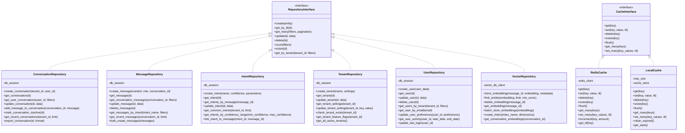

```mermaid
classDiagram
    class RepositoryInterface {
        <<interface>>
        +create(entity)
        +get_by_id(id)
        +get_many(filters, pagination)
        +update(id, data)
        +delete(id)
        +count(filters)
        +exists(id)
        +get_by_tenant(tenant_id, filters)
    }
    
    class ConversationRepository {
        -db_session
        +create_conversation(tenant_id, user_id)
        +get_conversation(id)
        +get_user_conversations(user_id, filters)
        +update_conversation(id, data)
        +add_message_to_conversation(conversation_id, message)
        +mark_conversation_inactive(id)
        +get_recent_conversations(tenant_id, limit)
        +export_conversation(id, format)
    }
    
    class MessageRepository {
        -db_session
        +create_message(content, role, conversation_id)
        +get_message(id)
        +get_conversation_messages(conversation_id, filters)
        +update_message(id, data)
        +delete_message(id)
        +get_messages_by_intent(intent_name, filters)
        +get_recent_messages(conversation_id, limit)
        +bulk_create_messages(messages)
    }
    
    class IntentRepository {
        -db_session
        +create_intent(name, confidence, parameters)
        +get_intent(id)
        +get_intents_by_message(message_id)
        +update_intent(id, data)
        +get_common_intents(tenant_id, limit)
        +get_intents_by_confidence_range(min_confidence, max_confidence)
        +link_intent_to_message(intent_id, message_id)
    }
    
    class TenantRepository {
        -db_session
        +create_tenant(name, settings)
        +get_tenant(id)
        +update_tenant(id, data)
        +get_tenant_settings(tenant_id)
        +update_tenant_setting(tenant_id, key, value)
        +check_tenant_exists(tenant_id)
        +get_tenant_feature_flags(tenant_id)
        +get_all_active_tenants()
    }
    
    class UserRepository {
        -db_session
        +create_user(user_data)
        +get_user(id)
        +update_user(id, data)
        +delete_user(id)
        +get_users_by_tenant(tenant_id, filters)
        +get_user_by_email(email)
        +update_user_preferences(user_id, preferences)
        +get_user_activity(user_id, start_date, end_date)
        +update_last_login(user_id)
    }
    
    class VectorRepository {
        -vector_db_client
        +store_embedding(message_id, embedding, metadata)
        +find_similar(embedding, limit, min_score)
        +delete_embedding(message_id)
        +get_embedding(message_id)
        +batch_store_embeddings(embeddings)
        +create_index(index_name, dimensions)
        +get_conversation_embeddings(conversation_id)
    }
    
    class CacheInterface {
        <<interface>>
        +get(key)
        +set(key, value, ttl)
        +delete(key)
        +exists(key)
        +flush()
        +get_many(keys)
        +set_many(key_values, ttl)
    }
    
    class RedisCache {
        -redis_client
        +get(key)
        +set(key, value, ttl)
        +delete(key)
        +exists(key)
        +flush()
        +get_many(keys)
        +set_many(key_values, ttl)
        +increment(key, amount)
        +get_ttl(key)
    }
    
    class LocalCache {
        -max_size
        -cache_store
        +get(key)
        +set(key, value, ttl)
        +delete(key)
        +exists(key)
        +flush()
        +get_many(keys)
        +set_many(key_values, ttl)
        +clean_expired()
        +get_stats()
    }
    
    RepositoryInterface <|.. ConversationRepository
    RepositoryInterface <|.. MessageRepository
    RepositoryInterface <|.. IntentRepository
    RepositoryInterface <|.. TenantRepository
    RepositoryInterface <|.. UserRepository
    RepositoryInterface <|.. VectorRepository
    
    CacheInterface <|.. RedisCache
    CacheInterface <|.. LocalCache
```