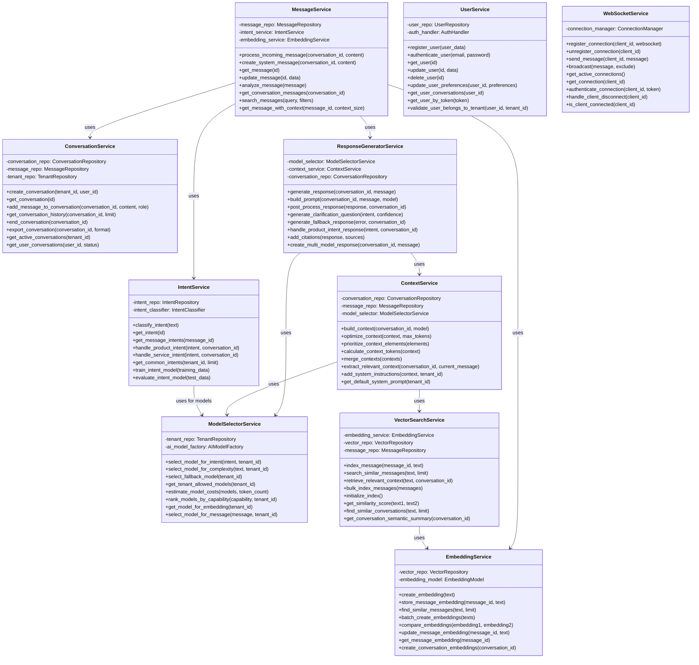

```mermaid
classDiagram
    class ConversationService {
        -conversation_repo: ConversationRepository
        -message_repo: MessageRepository
        -tenant_repo: TenantRepository
        +create_conversation(tenant_id, user_id)
        +get_conversation(id)
        +add_message_to_conversation(conversation_id, content, role)
        +get_conversation_history(conversation_id, limit)
        +end_conversation(conversation_id)
        +export_conversation(conversation_id, format)
        +get_active_conversations(tenant_id)
        +get_user_conversations(user_id, status)
    }
    
    class MessageService {
        -message_repo: MessageRepository
        -intent_service: IntentService
        -embedding_service: EmbeddingService
        +process_incoming_message(conversation_id, content)
        +create_system_message(conversation_id, content)
        +get_message(id)
        +update_message(id, data)
        +analyze_message(message)
        +get_conversation_messages(conversation_id)
        +search_messages(query, filters)
        +get_message_with_context(message_id, context_size)
    }
    
    class IntentService {
        -intent_repo: IntentRepository
        -intent_classifier: IntentClassifier
        +classify_intent(text)
        +get_intent(id)
        +get_message_intents(message_id)
        +handle_product_intent(intent, conversation_id)
        +handle_service_intent(intent, conversation_id)
        +get_common_intents(tenant_id, limit)
        +train_intent_model(training_data)
        +evaluate_intent_model(test_data)
    }
    
    class ContextService {
        -conversation_repo: ConversationRepository
        -message_repo: MessageRepository
        -model_selector: ModelSelectorService
        +build_context(conversation_id, model)
        +optimize_context(context, max_tokens)
        +prioritize_context_elements(elements)
        +calculate_context_tokens(context)
        +merge_contexts(contexts)
        +extract_relevant_context(conversation_id, current_message)
        +add_system_instructions(context, tenant_id)
        +get_default_system_prompt(tenant_id)
    }
    
    class ResponseGeneratorService {
        -model_selector: ModelSelectorService
        -context_service: ContextService
        -conversation_repo: ConversationRepository
        +generate_response(conversation_id, message)
        +build_prompt(conversation_id, message, model)
        +post_process_response(response, conversation_id)
        +generate_clarification_question(intent, confidence)
        +generate_fallback_response(error, conversation_id)
        +handle_product_intent_response(intent, conversation_id)
        +add_citations(response, sources)
        +create_multi_model_response(conversation_id, message)
    }
    
    class ModelSelectorService {
        -tenant_repo: TenantRepository
        -ai_model_factory: AIModelFactory
        +select_model_for_intent(intent, tenant_id)
        +select_model_for_complexity(text, tenant_id)
        +select_fallback_model(tenant_id)
        +get_tenant_allowed_models(tenant_id)
        +estimate_model_costs(models, token_count)
        +rank_models_by_capability(capability, tenant_id)
        +get_model_for_embedding(tenant_id)
        +select_model_for_message(message, tenant_id)
    }
    
    class EmbeddingService {
        -vector_repo: VectorRepository
        -embedding_model: EmbeddingModel
        +create_embedding(text)
        +store_message_embedding(message_id, text)
        +find_similar_messages(text, limit)
        +batch_create_embeddings(texts)
        +compare_embeddings(embedding1, embedding2)
        +update_message_embedding(message_id, text)
        +get_message_embedding(message_id)
        +create_conversation_embeddings(conversation_id)
    }
    
    class VectorSearchService {
        -embedding_service: EmbeddingService
        -vector_repo: VectorRepository
        -message_repo: MessageRepository
        +index_message(message_id, text)
        +search_similar_messages(text, limit)
        +retrieve_relevant_context(text, conversation_id)
        +bulk_index_messages(messages)
        +initialize_index()
        +get_similarity_score(text1, text2)
        +find_similar_conversations(text, limit)
        +get_conversation_semantic_summary(conversation_id)
    }
    
    class UserService {
        -user_repo: UserRepository
        -auth_handler: AuthHandler
        +register_user(user_data)
        +authenticate_user(email, password)
        +get_user(id)
        +update_user(id, data)
        +delete_user(id)
        +update_user_preferences(user_id, preferences)
        +get_user_conversations(user_id)
        +get_user_by_token(token)
        +validate_user_belongs_to_tenant(user_id, tenant_id)
    }
    
    class WebSocketService {
        -connection_manager: ConnectionManager
        +register_connection(client_id, websocket)
        +unregister_connection(client_id)
        +send_message(client_id, message)
        +broadcast(message, exclude)
        +get_active_connections()
        +get_connection(client_id)
        +authenticate_connection(client_id, token)
        +handle_client_disconnect(client_id)
        +is_client_connected(client_id)
    }
    
    MessageService --> IntentService : uses
    MessageService --> EmbeddingService : uses
    MessageService --> ConversationService : uses
    MessageService --> ResponseGeneratorService : uses
    
    ResponseGeneratorService --> ModelSelectorService : uses
    ResponseGeneratorService --> ContextService : uses
    
    VectorSearchService --> EmbeddingService : uses
    
    ContextService --> VectorSearchService : uses
    ContextService --> ModelSelectorService : uses
    
    IntentService --> ModelSelectorService : uses for models
```