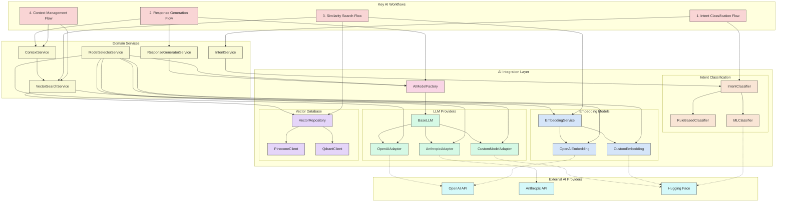

```mermaid

graph TD
    subgraph "AI Integration Layer"
        A1[AIModelFactory]
        
        subgraph "LLM Providers"
            B1[BaseLLM]
            B2[OpenAIAdapter]
            B3[AnthropicAdapter]
            B4[CustomModelAdapter]
        end
        
        subgraph "Embedding Models"
            C1[EmbeddingService]
            C2[OpenAIEmbedding]
            C3[CustomEmbedding]
        end
        
        subgraph "Intent Classification"
            D1[IntentClassifier]
            D2[RuleBasedClassifier]
            D3[MLClassifier]
        end
        
        subgraph "Vector Database"
            E1[VectorRepository]
            E2[PineconeClient]
            E3[QdrantClient]
        end
    end
    
    subgraph "Domain Services"
        F1[IntentService]
        F2[ResponseGeneratorService]
        F3[ModelSelectorService]
        F4[VectorSearchService]
        F5[ContextService]
    end
    
    subgraph "External AI Providers"
        G1[OpenAI API]
        G2[Anthropic API]
        G3[Hugging Face]
    end
    
    %% Domain services using AI components
    F1-->D1
    F2-->A1
    F3-->A1
    F4-->C1
    F4-->E1
    F5-->F4
    
    %% AI Factory creating specific implementations
    A1-->B1
    B1-->B2
    B1-->B3
    B1-->B4
    
    %% Embedding Service implementations
    C1-->C2
    C1-->C3
    
    %% Intent classifier implementations
    D1-->D2
    D1-->D3
    
    %% Vector DB implementations
    E1-->E2
    E1-->E3
    
    %% External API connections
    B2-.->G1
    B3-.->G2
    B4-.->G3
    C2-.->G1
    C3-.->G3
    D3-.->G3
    
    subgraph "Key AI Workflows"
        H1["1. Intent Classification Flow"]
        H2["2. Response Generation Flow"]
        H3["3. Similarity Search Flow"]
        H4["4. Context Management Flow"]
    end
    
    %% Workflow connections
    H1-->F1
    H1-->D1
    H2-->F2
    H2-->A1
    H2-->F5
    H3-->F4
    H3-->C1
    H3-->E1
    H4-->F5
    H4-->F4
    
    %% Model selection and orchestration
    F3-->B2
    F3-->B3
    F3-->B4
    F3-->C2
    F3-->C3
    
    classDef aiFactory fill:#f9d5e5,stroke:#333,stroke-width:1px;
    classDef llmProviders fill:#d5f9e5,stroke:#333,stroke-width:1px;
    classDef embeddings fill:#d5e5f9,stroke:#333,stroke-width:1px;
    classDef intent fill:#f9e5d5,stroke:#333,stroke-width:1px;
    classDef vectorDB fill:#e5d5f9,stroke:#333,stroke-width:1px;
    classDef domainServices fill:#f9f9d5,stroke:#333,stroke-width:1px;
    classDef external fill:#d5f9f9,stroke:#333,stroke-width:1px;
    classDef workflows fill:#f9d5d5,stroke:#333,stroke-width:1px;
    
    class A1 aiFactory;
    class B1,B2,B3,B4 llmProviders;
    class C1,C2,C3 embeddings;
    class D1,D2,D3 intent;
    class E1,E2,E3 vectorDB;
    class F1,F2,F3,F4,F5 domainServices;
    class G1,G2,G3 external;
    class H1,H2,H3,H4 workflows;
```