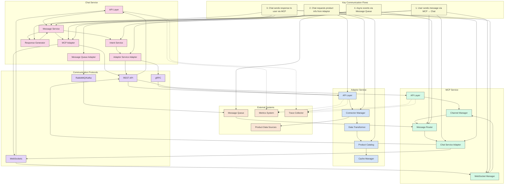

```mermaid
graph TD
    subgraph "Chat Service"
        A1[API Layer]
        A2[Message Service]
        A3[Intent Service]
        A4[Response Generator]
        A5[MCP Adapter]
        A6[Adaptor Service Adapter]
        A7[Message Queue Adapter]
    end
    
    subgraph "MCP Service"
        B1[API Layer]
        B2[WebSocket Manager]
        B3[Channel Manager]
        B4[Message Router]
        B5[Chat Service Adapter]
    end
    
    subgraph "Adaptor Service"
        C1[API Layer]
        C2[Connector Manager]
        C3[Data Transformer]
        C4[Product Catalog]
        C5[Cache Manager]
    end
    
    subgraph "External Systems"
        D1[Message Queue]
        D2[Metrics System]
        D3[Trace Collector]
        D4[Product Data Sources]
    end
    
    subgraph "Communication Protocols"
        E1[REST API]
        E2[WebSockets]
        E3[RabbitMQ/Kafka]
        E4[gRPC]
    end
    
    %% Chat Service to MCP Service communication
    A5-->E1
    A5-->E2
    E1-->B1
    E2-->B2
    
    %% MCP Service to Chat Service communication
    B5-->E1
    B5-->E2
    E1-->A1
    E2-->A1
    
    %% Chat Service to Adaptor Service communication
    A6-->E1
    A6-->E4
    E1-->C1
    E4-->C1
    
    %% Message Queue communication
    A7-->E3
    E3-->D1
    D1-->B4
    
    %% Data flows within Chat Service
    A1-->A2
    A2-->A3
    A2-->A4
    A4-->A2
    A2-->A5
    A3-->A6
    
    %% Data flows within MCP Service
    B1-->B3
    B2-->B3
    B3-->B4
    B4-->B5
    
    %% Data flows within Adaptor Service
    C1-->C2
    C2-->C3
    C3-->C4
    C4-->C5
    
    %% External data sources for Adaptor Service
    C2-->D4
    
    %% Observability connections
    A1-.->D2
    A1-.->D3
    B1-.->D2
    B1-.->D3
    C1-.->D2
    C1-.->D3
    
    subgraph "Key Communication Flows"
        F1["1. User sends message via MCP → Chat"]
        F2["2. Chat requests product info from Adaptor"]
        F3["3. Chat sends response to user via MCP"]
        F4["4. Async events via Message Queue"]
    end
    
    %% Flow connections
    F1-->B2
    F1-->B4
    F1-->B5
    F1-->A5
    F1-->A2
    
    F2-->A3
    F2-->A6
    F2-->C1
    F2-->C2
    F2-->C4
    
    F3-->A4
    F3-->A2
    F3-->A5
    F3-->B5
    F3-->B2
    
    F4-->A7
    F4-->D1
    F4-->B4
    
    classDef chatService fill:#f9d5e5,stroke:#333,stroke-width:1px;
    classDef mcpService fill:#d5f9e5,stroke:#333,stroke-width:1px;
    classDef adaptorService fill:#d5e5f9,stroke:#333,stroke-width:1px;
    classDef external fill:#f9e5d5,stroke:#333,stroke-width:1px;
    classDef protocols fill:#e5d5f9,stroke:#333,stroke-width:1px;
    classDef flows fill:#f9f9d5,stroke:#333,stroke-width:1px;
    
    class A1,A2,A3,A4,A5,A6,A7 chatService;
    class B1,B2,B3,B4,B5 mcpService;
    class C1,C2,C3,C4,C5 adaptorService;
    class D1,D2,D3,D4 external;
    class E1,E2,E3,E4 protocols;
    class F1,F2,F3,F4 flows;
```