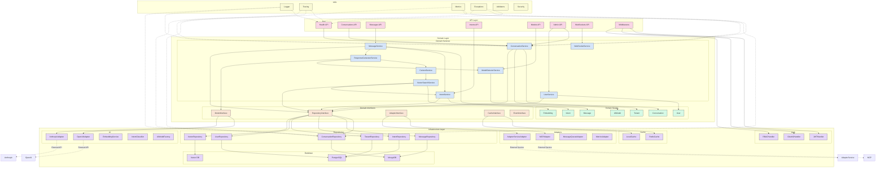

```mermaid
graph TD
    subgraph "API Layer"
        A1[Health API]
        A2[Conversations API]
        A3[Messages API]
        A4[Intents API]
        A5[Models API]
        A6[Admin API]
        A7[WebSockets API]
        A8[Middlewares]
    end
    
    subgraph "Domain Layer"
        subgraph "Domain Models"
            B1[Conversation]
            B2[Message]
            B3[Intent]
            B4[User]
            B5[Tenant]
            B6[AIModel]
            B7[Embedding]
        end
        
        subgraph "Domain Services"
            C1[ConversationService]
            C2[MessageService]
            C3[IntentService]
            C4[ContextService]
            C5[ResponseGeneratorService]
            C6[ModelSelectorService]
            C7[VectorSearchService]
            C8[UserService]
            C9[WebSocketService]
        end
        
        subgraph "Domain Interfaces"
            D1[RepositoryInterface]
            D2[ModelInterface]
            D3[AdapterInterface]
            D4[CacheInterface]
            D5[EventInterface]
        end
    end
    
    subgraph "Infrastructure Layer"
        subgraph "Repositories"
            E1[ConversationRepository]
            E2[MessageRepository]
            E3[IntentRepository]
            E4[TenantRepository]
            E5[UserRepository]
            E6[VectorRepository]
        end
        
        subgraph "Adapters"
            F1[MCPAdapter]
            F2[AdaptorServiceAdapter]
            F3[MessageQueueAdapter]
            F4[MetricsAdapter]
        end
        
        subgraph "AI"
            G1[OpenAIAdapter]
            G2[AnthropicAdapter]
            G3[EmbeddingService]
            G4[IntentClassifier]
            G5[AIModelFactory]
        end
        
        subgraph "Database"
            H1[MongoDB]
            H2[PostgreSQL]
            H3[Vector DB]
        end
        
        subgraph "Cache"
            I1[RedisCache]
            I2[LocalCache]
        end
        
        subgraph "Auth"
            J1[JWTHandler]
            J2[OAuth2Handler]
            J3[RBACHandler]
        end
    end
    
    subgraph "Utils"
        K1[Logger]
        K2[Tracing]
        K3[Metrics]
        K4[Exceptions]
        K5[Validators]
        K6[Security]
    end
    
    %% API Layer to Domain Layer
    A1-->C1
    A2-->C1
    A3-->C2
    A4-->C3
    A5-->C6
    A6-->C1
    A6-->C8
    A7-->C9
    
    %% Domain Services to Domain Models
    C1-->B1
    C2-->B2
    C3-->B3
    C8-->B4
    C1-->B5
    C6-->B6
    C7-->B7
    
    %% Domain Services to Domain Services
    C2-->C3
    C2-->C5
    C5-->C4
    C5-->C6
    C4-->C7
    C7-->C3
    
    %% Domain Services to Domain Interfaces
    C1-->D1
    C2-->D1
    C3-->D1
    C5-->D2
    C7-->D1
    C8-->D1
    
    %% Infrastructure implementations to Domain Interfaces
    D1-->E1
    D1-->E2
    D1-->E3
    D1-->E4
    D1-->E5
    D1-->E6
    D2-->G1
    D2-->G2
    D3-->F1
    D3-->F2
    D4-->I1
    D4-->I2
    
    %% Repositories to Database
    E1-->H1
    E2-->H1
    E3-->H2
    E4-->H2
    E5-->H2
    E6-->H3
    
    %% AI to External Services
    G1-.->|External API|OpenAI
    G2-.->|External API|Anthropic
    
    %% Adapters to External Services
    F1-.->|External Service|MCP
    F2-.->|External Service|AdaptorService
    
    %% Utilities used across layers
    K1-.->A1
    K1-.->C1
    K1-.->E1
    K2-.->A1
    K2-.->C1
    K2-.->E1
    K3-.->A1
    K3-.->C1
    K3-.->E1
    K4-.->A1
    K4-.->C1
    K4-.->E1
    
    %% Auth used by API Layer
    A8-->J1
    A8-->J2
    A8-->J3
    
    classDef apiLayer fill:#f9d5e5,stroke:#333,stroke-width:1px;
    classDef domainModels fill:#d5f9e5,stroke:#333,stroke-width:1px;
    classDef domainServices fill:#d5e5f9,stroke:#333,stroke-width:1px;
    classDef domainInterfaces fill:#f9e5d5,stroke:#333,stroke-width:1px;
    classDef infraLayer fill:#e5d5f9,stroke:#333,stroke-width:1px;
    classDef utilsLayer fill:#f9f9d5,stroke:#333,stroke-width:1px;
    
    class A1,A2,A3,A4,A5,A6,A7,A8 apiLayer;
    class B1,B2,B3,B4,B5,B6,B7 domainModels;
    class C1,C2,C3,C4,C5,C6,C7,C8,C9 domainServices;
    class D1,D2,D3,D4,D5 domainInterfaces;
    class E1,E2,E3,E4,E5,E6,F1,F2,F3,F4,G1,G2,G3,G4,G5,H1,H2,H3,I1,I2,J1,J2,J3 infraLayer;
    class K1,K2,K3,K4,K5,K6 utilsLayer;
```