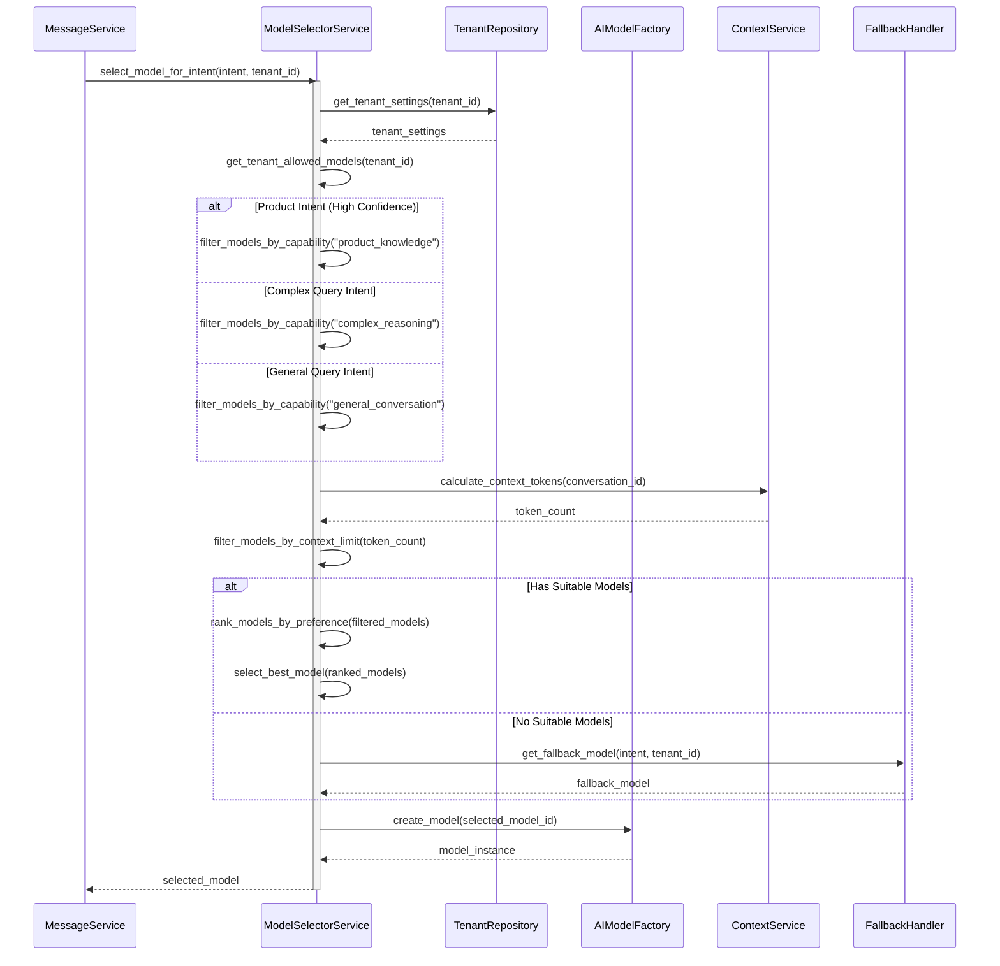

```mermaid
sequenceDiagram
    participant MessageService
    participant ModelSelectorService
    participant TenantRepository
    participant AIModelFactory
    participant ContextService
    participant FallbackHandler
    
    MessageService->>ModelSelectorService: select_model_for_intent(intent, tenant_id)
    activate ModelSelectorService
    
    ModelSelectorService->>TenantRepository: get_tenant_settings(tenant_id)
    TenantRepository-->>ModelSelectorService: tenant_settings
    
    ModelSelectorService->>ModelSelectorService: get_tenant_allowed_models(tenant_id)
    
    alt Product Intent (High Confidence)
        ModelSelectorService->>ModelSelectorService: filter_models_by_capability("product_knowledge")
        
    else Complex Query Intent
        ModelSelectorService->>ModelSelectorService: filter_models_by_capability("complex_reasoning")
        
    else General Query Intent
        ModelSelectorService->>ModelSelectorService: filter_models_by_capability("general_conversation")
    end
    
    ModelSelectorService->>ContextService: calculate_context_tokens(conversation_id)
    ContextService-->>ModelSelectorService: token_count
    
    ModelSelectorService->>ModelSelectorService: filter_models_by_context_limit(token_count)
    
    alt Has Suitable Models
        ModelSelectorService->>ModelSelectorService: rank_models_by_preference(filtered_models)
        ModelSelectorService->>ModelSelectorService: select_best_model(ranked_models)
        
    else No Suitable Models
        ModelSelectorService->>FallbackHandler: get_fallback_model(intent, tenant_id)
        FallbackHandler-->>ModelSelectorService: fallback_model
    end
    
    ModelSelectorService->>AIModelFactory: create_model(selected_model_id)
    AIModelFactory-->>ModelSelectorService: model_instance
    
    ModelSelectorService-->>MessageService: selected_model
    deactivate ModelSelectorService
```