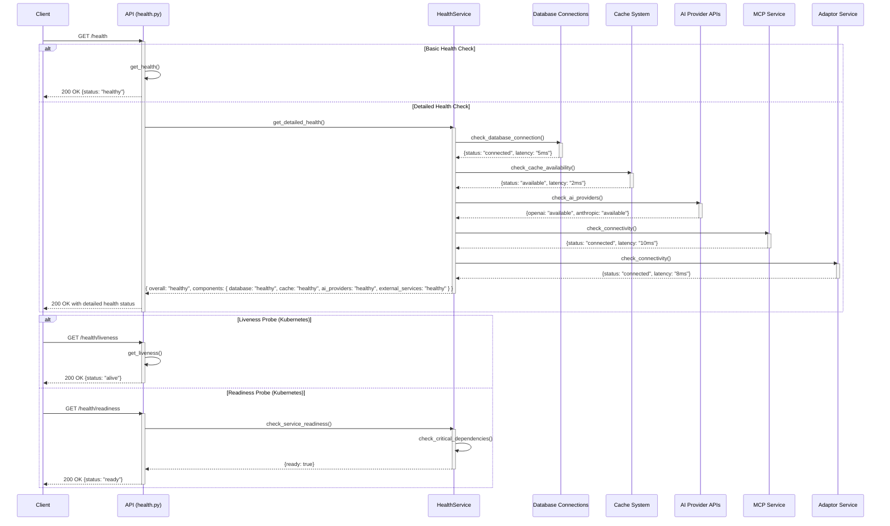

```mermaid
sequenceDiagram
    participant Client
    participant HealthAPI as API (health.py)
    participant HealthService
    participant DB as Database Connections
    participant Cache as Cache System
    participant AIAPI as AI Provider APIs
    participant MCP as MCP Service
    participant AdaptorSvc as Adaptor Service

    Client->>HealthAPI: GET /health
    activate HealthAPI
    alt Basic Health Check
        HealthAPI->>HealthAPI: get_health()
        HealthAPI-->>Client: 200 OK {status: "healthy"}
    else Detailed Health Check
        HealthAPI->>HealthService: get_detailed_health()
        activate HealthService
        HealthService->>DB: check_database_connection()
        activate DB
        DB-->>HealthService: {status: "connected", latency: "5ms"}
        deactivate DB
        HealthService->>Cache: check_cache_availability()
        activate Cache
        Cache-->>HealthService: {status: "available", latency: "2ms"}
        deactivate Cache
        HealthService->>AIAPI: check_ai_providers()
        activate AIAPI
        AIAPI-->>HealthService: {openai: "available", anthropic: "available"}
        deactivate AIAPI
        HealthService->>MCP: check_connectivity()
        activate MCP
        MCP-->>HealthService: {status: "connected", latency: "10ms"}
        deactivate MCP
        HealthService->>AdaptorSvc: check_connectivity()
        activate AdaptorSvc
        AdaptorSvc-->>HealthService: {status: "connected", latency: "8ms"}
        deactivate AdaptorSvc
        HealthService-->>HealthAPI: { overall: "healthy", components: { database: "healthy", cache: "healthy", ai_providers: "healthy", external_services: "healthy" } }
        deactivate HealthService
        HealthAPI-->>Client: 200 OK with detailed health status
    end
    deactivate HealthAPI

    alt Liveness Probe (Kubernetes)
        Client->>HealthAPI: GET /health/liveness
        activate HealthAPI
        HealthAPI->>HealthAPI: get_liveness()
        HealthAPI-->>Client: 200 OK {status: "alive"}
        deactivate HealthAPI
    else Readiness Probe (Kubernetes)
        Client->>HealthAPI: GET /health/readiness
        activate HealthAPI
        HealthAPI->>HealthService: check_service_readiness()
        activate HealthService
        HealthService->>HealthService: check_critical_dependencies()
        HealthService-->>HealthAPI: {ready: true}
        deactivate HealthService
        HealthAPI-->>Client: 200 OK {status: "ready"}
        deactivate HealthAPI
    end
```