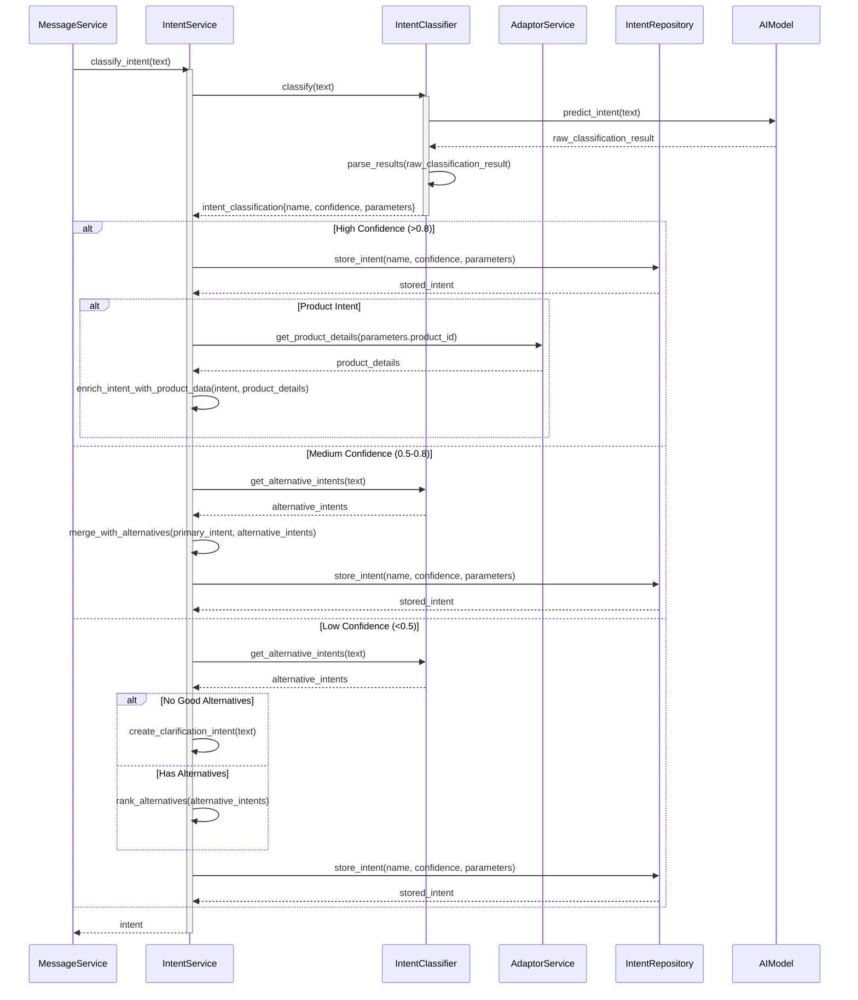

```mermaid
sequenceDiagram
    participant MessageService
    participant IntentService
    participant IntentClassifier
    participant AdaptorService
    participant IntentRepository
    participant AIModel
    
    MessageService->>IntentService: classify_intent(text)
    activate IntentService
    
    IntentService->>IntentClassifier: classify(text)
    activate IntentClassifier
    
    IntentClassifier->>AIModel: predict_intent(text)
    AIModel-->>IntentClassifier: raw_classification_result
    
    IntentClassifier->>IntentClassifier: parse_results(raw_classification_result)
    IntentClassifier-->>IntentService: intent_classification{name, confidence, parameters}
    deactivate IntentClassifier
    
    alt High Confidence (>0.8)
        IntentService->>IntentRepository: store_intent(name, confidence, parameters)
        IntentRepository-->>IntentService: stored_intent
        
        alt Product Intent
            IntentService->>AdaptorService: get_product_details(parameters.product_id)
            AdaptorService-->>IntentService: product_details
            IntentService->>IntentService: enrich_intent_with_product_data(intent, product_details)
        end
        
    else Medium Confidence (0.5-0.8)
        IntentService->>IntentClassifier: get_alternative_intents(text)
        IntentClassifier-->>IntentService: alternative_intents
        IntentService->>IntentService: merge_with_alternatives(primary_intent, alternative_intents)
        IntentService->>IntentRepository: store_intent(name, confidence, parameters)
        IntentRepository-->>IntentService: stored_intent
        
    else Low Confidence (<0.5)
        IntentService->>IntentClassifier: get_alternative_intents(text)
        IntentClassifier-->>IntentService: alternative_intents
        
        alt No Good Alternatives
            IntentService->>IntentService: create_clarification_intent(text)
        else Has Alternatives
            IntentService->>IntentService: rank_alternatives(alternative_intents)
        end
        
        IntentService->>IntentRepository: store_intent(name, confidence, parameters)
        IntentRepository-->>IntentService: stored_intent
    end
    
    IntentService-->>MessageService: intent
    deactivate IntentService
```