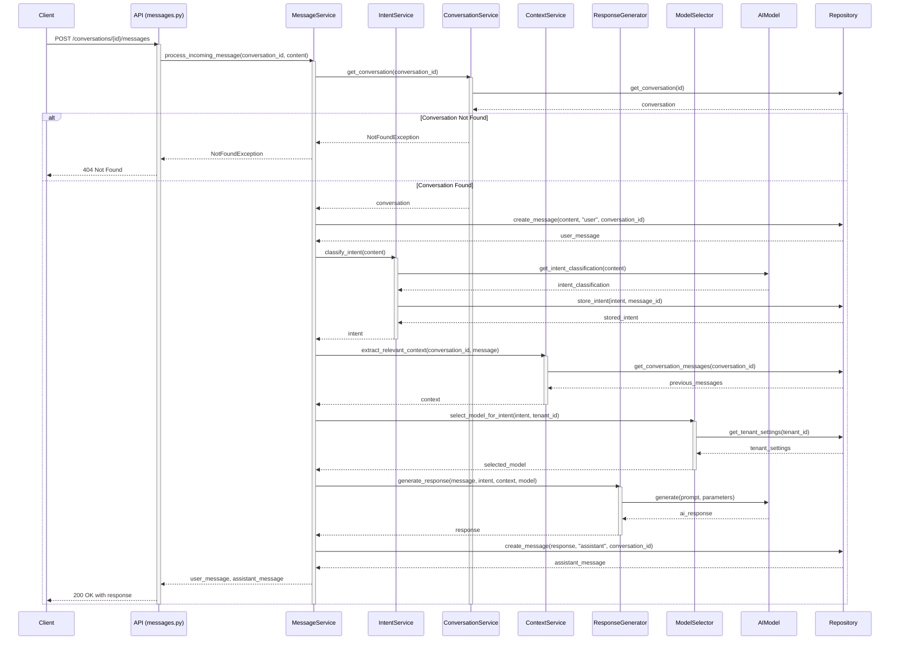

```mermaid
sequenceDiagram
    participant Client
    participant MessagesAPI as API (messages.py)
    participant MessageService
    participant IntentService
    participant ConversationService
    participant ContextService
    participant ResponseGenerator
    participant ModelSelector
    participant AIModel
    participant Repository
    
    Client->>MessagesAPI: POST /conversations/{id}/messages
    activate MessagesAPI
    
    MessagesAPI->>MessageService: process_incoming_message(conversation_id, content)
    activate MessageService
    
    MessageService->>ConversationService: get_conversation(conversation_id)
    activate ConversationService
    ConversationService->>Repository: get_conversation(id)
    Repository-->>ConversationService: conversation
    
    alt Conversation Not Found
        ConversationService-->>MessageService: NotFoundException
        MessageService-->>MessagesAPI: NotFoundException
        MessagesAPI-->>Client: 404 Not Found
    else Conversation Found
        ConversationService-->>MessageService: conversation
        MessageService->>Repository: create_message(content, "user", conversation_id)
        Repository-->>MessageService: user_message
        
        MessageService->>IntentService: classify_intent(content)
        activate IntentService
        IntentService->>AIModel: get_intent_classification(content)
        AIModel-->>IntentService: intent_classification
        IntentService->>Repository: store_intent(intent, message_id)
        Repository-->>IntentService: stored_intent
        IntentService-->>MessageService: intent
        deactivate IntentService
        
        MessageService->>ContextService: extract_relevant_context(conversation_id, message)
        activate ContextService
        ContextService->>Repository: get_conversation_messages(conversation_id)
        Repository-->>ContextService: previous_messages
        ContextService-->>MessageService: context
        deactivate ContextService
        
        MessageService->>ModelSelector: select_model_for_intent(intent, tenant_id)
        activate ModelSelector
        ModelSelector->>Repository: get_tenant_settings(tenant_id)
        Repository-->>ModelSelector: tenant_settings
        ModelSelector-->>MessageService: selected_model
        deactivate ModelSelector
        
        MessageService->>ResponseGenerator: generate_response(message, intent, context, model)
        activate ResponseGenerator
        ResponseGenerator->>AIModel: generate(prompt, parameters)
        AIModel-->>ResponseGenerator: ai_response
        ResponseGenerator-->>MessageService: response
        deactivate ResponseGenerator
        
        MessageService->>Repository: create_message(response, "assistant", conversation_id)
        Repository-->>MessageService: assistant_message
        
        MessageService-->>MessagesAPI: user_message, assistant_message
        MessagesAPI-->>Client: 200 OK with response
    end
    
    deactivate ConversationService
    deactivate MessageService
    deactivate MessagesAPI

```