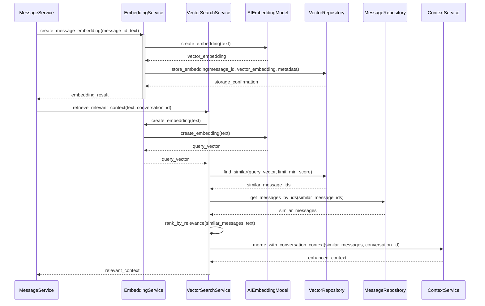

```mermaid
sequenceDiagram
    participant MessageService
    participant EmbeddingService
    participant VectorSearchService
    participant AIEmbeddingModel
    participant VectorRepository
    participant MessageRepository
    participant ContextService
    
    MessageService->>EmbeddingService: create_message_embedding(message_id, text)
    activate EmbeddingService
    
    EmbeddingService->>AIEmbeddingModel: create_embedding(text)
    AIEmbeddingModel-->>EmbeddingService: vector_embedding
    
    EmbeddingService->>VectorRepository: store_embedding(message_id, vector_embedding, metadata)
    VectorRepository-->>EmbeddingService: storage_confirmation
    
    EmbeddingService-->>MessageService: embedding_result
    deactivate EmbeddingService
    
    MessageService->>VectorSearchService: retrieve_relevant_context(text, conversation_id)
    activate VectorSearchService
    
    VectorSearchService->>EmbeddingService: create_embedding(text)
    EmbeddingService->>AIEmbeddingModel: create_embedding(text)
    AIEmbeddingModel-->>EmbeddingService: query_vector
    EmbeddingService-->>VectorSearchService: query_vector
    
    VectorSearchService->>VectorRepository: find_similar(query_vector, limit, min_score)
    VectorRepository-->>VectorSearchService: similar_message_ids
    
    VectorSearchService->>MessageRepository: get_messages_by_ids(similar_message_ids)
    MessageRepository-->>VectorSearchService: similar_messages
    
    VectorSearchService->>VectorSearchService: rank_by_relevance(similar_messages, text)
    
    VectorSearchService->>ContextService: merge_with_conversation_context(similar_messages, conversation_id)
    ContextService-->>VectorSearchService: enhanced_context
    
    VectorSearchService-->>MessageService: relevant_context
    deactivate VectorSearchService
```