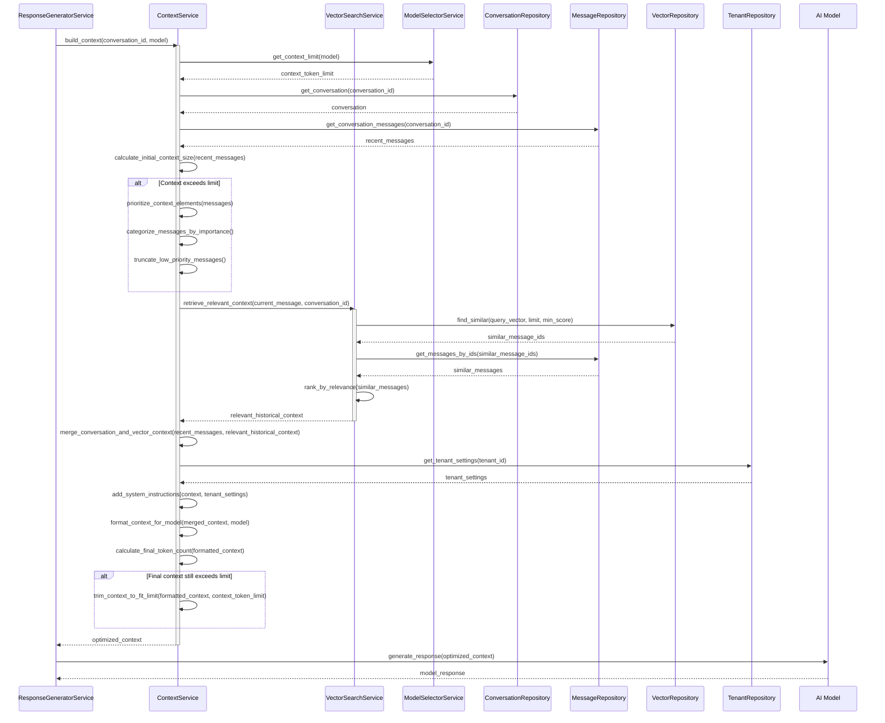

```mermaid
sequenceDiagram
    participant RP as ResponseGeneratorService
    participant CS as ContextService
    participant VS as VectorSearchService
    participant MS as ModelSelectorService
    participant CR as ConversationRepository
    participant MR as MessageRepository
    participant VR as VectorRepository
    participant TR as TenantRepository
    participant AI as AI Model
    
    RP->>CS: build_context(conversation_id, model)
    activate CS
    
    CS->>MS: get_context_limit(model)
    MS-->>CS: context_token_limit
    
    CS->>CR: get_conversation(conversation_id)
    CR-->>CS: conversation
    
    CS->>MR: get_conversation_messages(conversation_id)
    MR-->>CS: recent_messages
    
    CS->>CS: calculate_initial_context_size(recent_messages)
    
    alt Context exceeds limit
        CS->>CS: prioritize_context_elements(messages)
        
        CS->>CS: categorize_messages_by_importance()
        
        CS->>CS: truncate_low_priority_messages()
    end
    
    CS->>VS: retrieve_relevant_context(current_message, conversation_id)
    activate VS
    
    VS->>VR: find_similar(query_vector, limit, min_score)
    VR-->>VS: similar_message_ids
    
    VS->>MR: get_messages_by_ids(similar_message_ids)
    MR-->>VS: similar_messages
    
    VS->>VS: rank_by_relevance(similar_messages)
    VS-->>CS: relevant_historical_context
    deactivate VS
    
    CS->>CS: merge_conversation_and_vector_context(recent_messages, relevant_historical_context)
    
    CS->>TR: get_tenant_settings(tenant_id)
    TR-->>CS: tenant_settings
    
    CS->>CS: add_system_instructions(context, tenant_settings)
    
    CS->>CS: format_context_for_model(merged_context, model)
    
    CS->>CS: calculate_final_token_count(formatted_context)
    
    alt Final context still exceeds limit
        CS->>CS: trim_context_to_fit_limit(formatted_context, context_token_limit)
    end
    
    CS-->>RP: optimized_context
    deactivate CS
    
    RP->>AI: generate_response(optimized_context)
    AI-->>RP: model_response
```