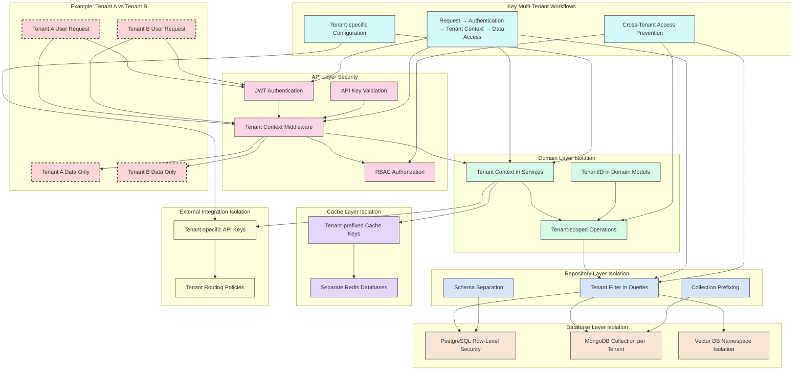

```mermaid
graph TD
    subgraph "API Layer Security"
        A1[JWT Authentication]
        A2[Tenant Context Middleware]
        A3[RBAC Authorization]
        A4[API Key Validation]
    end
    
    subgraph "Domain Layer Isolation"
        B1[TenantID in Domain Models]
        B2[Tenant Context in Services]
        B3[Tenant-scoped Operations]
    end
    
    subgraph "Repository Layer Isolation"
        C1[Tenant Filter in Queries]
        C2[Schema Separation]
        C3[Collection Prefixing]
    end
    
    subgraph "Database Layer Isolation"
        D1[PostgreSQL Row-Level Security]
        D2[MongoDB Collection per Tenant]
        D3[Vector DB Namespace Isolation]
    end
    
    subgraph "Cache Layer Isolation"
        E1[Tenant-prefixed Cache Keys]
        E2[Separate Redis Databases]
    end
    
    subgraph "External Integration Isolation"
        F1[Tenant-specific API Keys]
        F2[Tenant Routing Policies]
    end
    
    subgraph "Key Multi-Tenant Workflows"
        G1["Request → Authentication → Tenant Context → Data Access"]
        G2["Cross-Tenant Access Prevention"]
        G3["Tenant-specific Configuration"]
    end
    
    %% Request flow through layers
    A1-->A2
    A2-->A3
    A2-->B2
    B2-->B3
    B3-->C1
    C1-->D1
    C1-->D2
    C1-->D3
    B2-->E1
    
    %% Domain model structure
    B1-->B3
    
    %% Alternative authentication
    A4-->A2
    
    %% Database implementation specifics
    C2-->D1
    C3-->D2
    
    %% Cache isolation
    E1-->E2
    
    %% External integration isolation
    B2-->F1
    F1-->F2
    
    %% Workflow connections
    G1-->A1
    G1-->A2
    G1-->B2
    G1-->C1
    
    G2-->A3
    G2-->B3
    G2-->C1
    
    G3-->B2
    G3-->F1
    
    subgraph "Example: Tenant A vs Tenant B"
        H1["Tenant A User Request"]
        H2["Tenant A Data Only"]
        H3["Tenant B User Request"]
        H4["Tenant B Data Only"]
    end
    
    %% Example flow
    H1-->A1
    H1-->A2
    A2-->H2
    H3-->A1
    H3-->A2
    A2-->H4
    
    classDef apiSecurity fill:#f9d5e5,stroke:#333,stroke-width:1px;
    classDef domainIsolation fill:#d5f9e5,stroke:#333,stroke-width:1px;
    classDef repoIsolation fill:#d5e5f9,stroke:#333,stroke-width:1px;
    classDef dbIsolation fill:#f9e5d5,stroke:#333,stroke-width:1px;
    classDef cacheIsolation fill:#e5d5f9,stroke:#333,stroke-width:1px;
    classDef extIsolation fill:#f9f9d5,stroke:#333,stroke-width:1px;
    classDef workflows fill:#d5f9f9,stroke:#333,stroke-width:1px;
    classDef example fill:#f9d5d5,stroke:#333,stroke-width:2px,stroke-dasharray: 5 5;
    
    class A1,A2,A3,A4 apiSecurity;
    class B1,B2,B3 domainIsolation;
    class C1,C2,C3 repoIsolation;
    class D1,D2,D3 dbIsolation;
    class E1,E2 cacheIsolation;
    class F1,F2 extIsolation;
    class G1,G2,G3 workflows;
    class H1,H2,H3,H4 example;
```