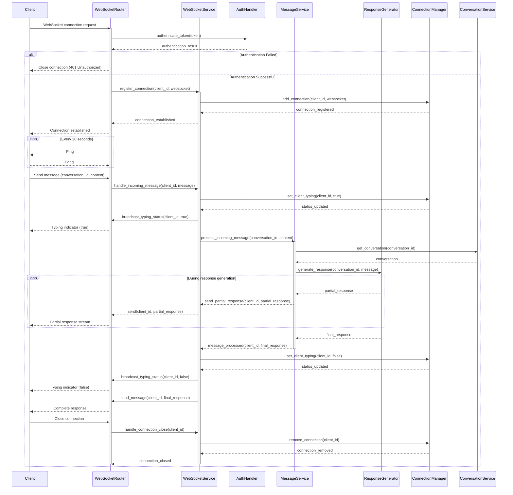

```mermaid
sequenceDiagram
    participant Client
    participant WSRouter as WebSocketRouter
    participant WSService as WebSocketService
    participant AuthHandler
    participant MessageService
    participant ResponseGenerator
    participant ConnectionManager
    participant ConversationService
    
    Client->>WSRouter: WebSocket connection request
    activate WSRouter
    
    WSRouter->>AuthHandler: authenticate_token(token)
    AuthHandler-->>WSRouter: authentication_result
    
    alt Authentication Failed
        WSRouter-->>Client: Close connection (401 Unauthorized)
        
    else Authentication Successful
        WSRouter->>WSService: register_connection(client_id, websocket)
        activate WSService
        
        WSService->>ConnectionManager: add_connection(client_id, websocket)
        ConnectionManager-->>WSService: connection_registered
        
        WSService-->>WSRouter: connection_established
        WSRouter-->>Client: Connection established
        
        %% Heartbeat loop
        loop Every 30 seconds
            WSRouter->>Client: Ping
            Client-->>WSRouter: Pong
        end
        
        %% Message handling
        Client->>WSRouter: Send message {conversation_id, content}
        WSRouter->>WSService: handle_incoming_message(client_id, message)
        
        WSService->>ConnectionManager: set_client_typing(client_id, true)
        ConnectionManager-->>WSService: status_updated
        
        WSService->>WSRouter: broadcast_typing_status(client_id, true)
        WSRouter-->>Client: Typing indicator (true)
        
        WSService->>MessageService: process_incoming_message(conversation_id, content)
        activate MessageService
        
        MessageService->>ConversationService: get_conversation(conversation_id)
        ConversationService-->>MessageService: conversation
        
        MessageService->>ResponseGenerator: generate_response(conversation_id, message)
        
        loop During response generation
            ResponseGenerator-->>MessageService: partial_response
            MessageService-->>WSService: send_partial_response(client_id, partial_response)
            WSService-->>WSRouter: send(client_id, partial_response)
            WSRouter-->>Client: Partial response stream
        end
        
        ResponseGenerator-->>MessageService: final_response
        MessageService-->>WSService: message_processed(client_id, final_response)
        deactivate MessageService
        
        WSService->>ConnectionManager: set_client_typing(client_id, false)
        ConnectionManager-->>WSService: status_updated
        
        WSService->>WSRouter: broadcast_typing_status(client_id, false)
        WSRouter-->>Client: Typing indicator (false)
        
        WSService->>WSRouter: send_message(client_id, final_response)
        WSRouter-->>Client: Complete response
        
        %% Connection closing
        Client->>WSRouter: Close connection
        WSRouter->>WSService: handle_connection_close(client_id)
        
        WSService->>ConnectionManager: remove_connection(client_id)
        ConnectionManager-->>WSService: connection_removed
        
        WSService-->>WSRouter: connection_closed
        deactivate WSService
        deactivate WSRouter
    end
```